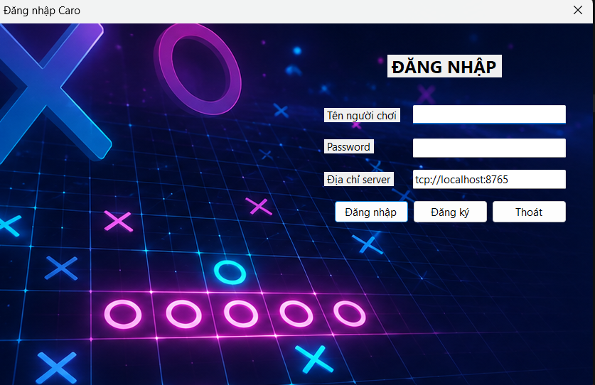
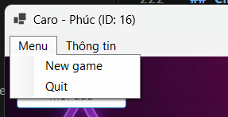
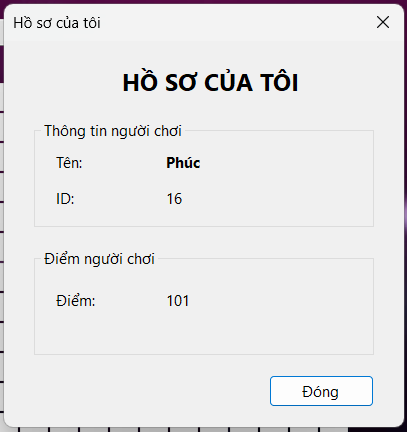
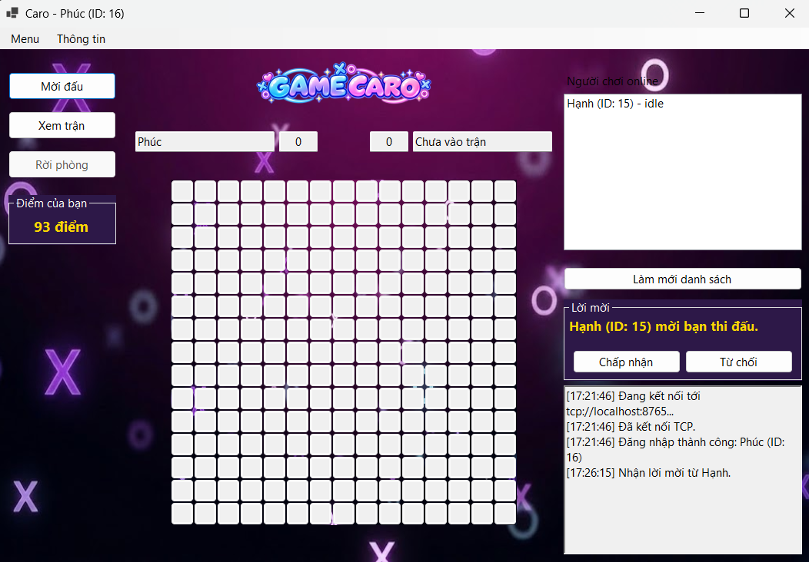
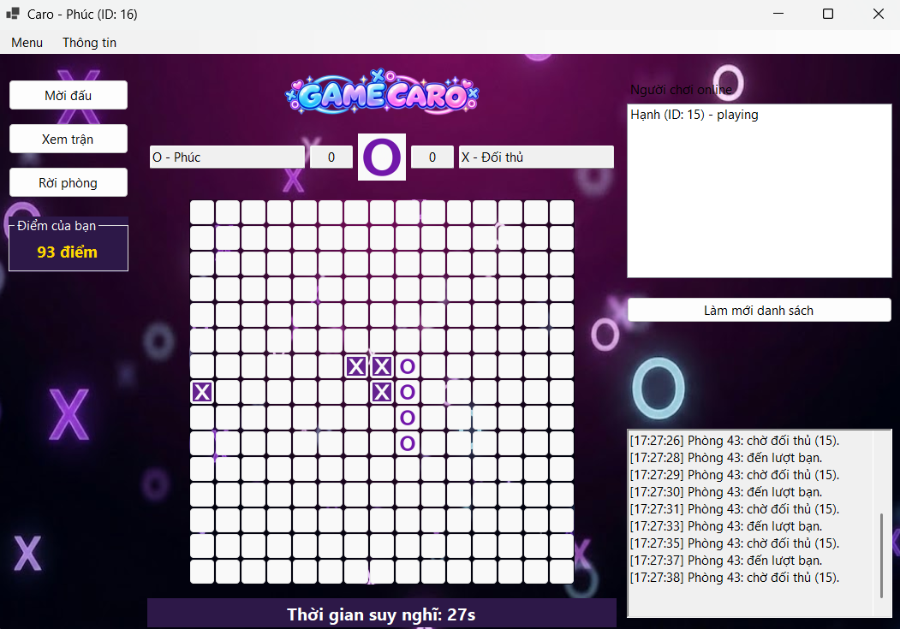
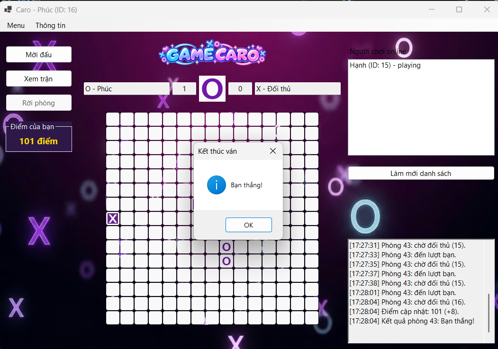
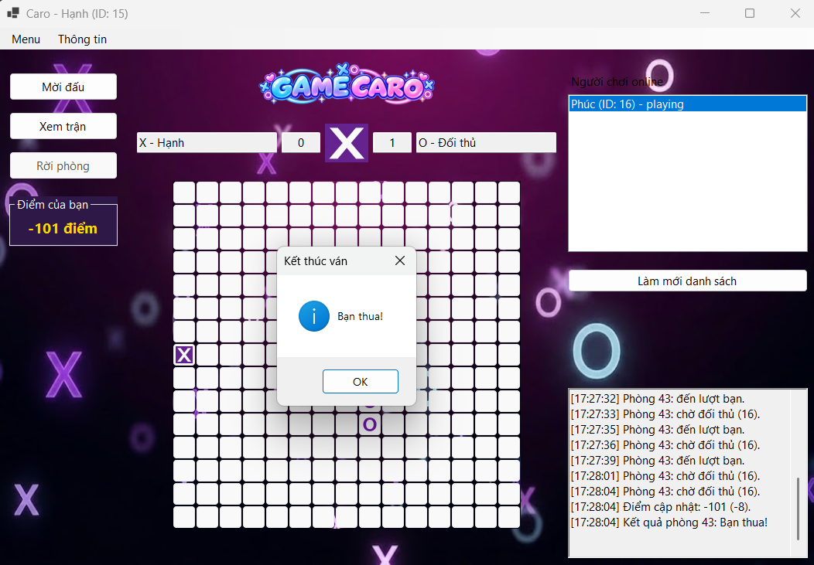
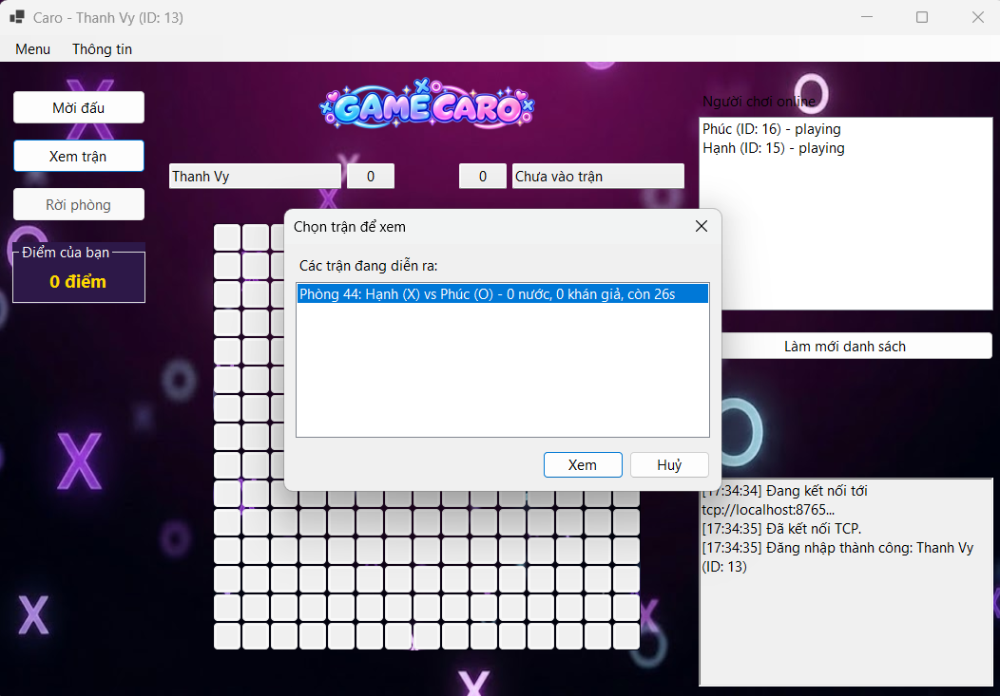
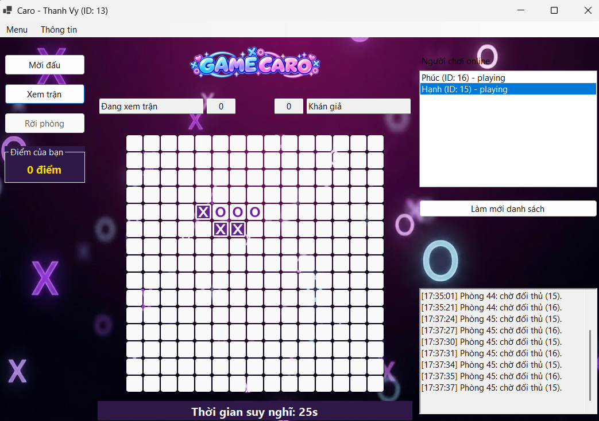
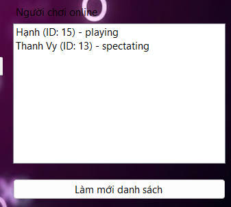

# UDM_16 - Game Caro trực tuyến

## Thành viên

| STT | MSSV         | Họ và tên              | Vai trò    |
| --: | ------------ | ---------------------- | ---------- |
|   1 | 089206010393 | Lê Thiên Hạo           | Leader     |
|   2 | 082306014560 | Phạm Lê Ngọc Hân       | Thành viên |
|   3 | 067206003213 | Trương Tấn Kiệt        | Thành viên |
|   4 | 077206000886 | Ngô Minh Đăng Khoa     | Thành viên |
|   5 | 084206002822 | Trầm Đồng Khởi         | Thành viên |
|   6 | 052206000320 | Nguyễn Đình Duy Khương | Thành viên |

## Giới thiệu

UDM_16 là đồ án Game Caro trực tuyến cho phép nhiều người chơi kết nối đến server, xem danh sách người chơi đang online, mời đấu, tham gia trận đấu và đồng bộ trạng thái bàn cờ theo thời gian thực.

Mục tiêu của project là xây dựng một hệ thống chơi Caro theo mô hình client-server, trong đó server chịu trách nhiệm quản lý kết nối, phòng đấu, lượt chơi, trạng thái trận đấu, kết quả và lịch sử ván chơi.

## Kiến trúc hệ thống

- Mô hình: Client-Server.
- Server: Python, socket + `selectors` (một luồng duy nhất), SQLAlchemy, PostgreSQL.
- Client: C#/.NET — thư viện `CaroClient.Core`, giao diện WinForms `Caroclient.UI`, và một client dòng lệnh để kiểm thử.
- Shared: schema message dùng chung giữa client và server.
- Protocol: TCP. Mỗi message đóng khung bằng header 4 byte big-endian ghi độ dài, tiếp theo là thân JSON mã hoá UTF-8.
- Port mặc định của server: `8765`.
- Port PostgreSQL: `5432` trong Docker network, ánh xạ ra host là `5433`.

```text
NETPRO/
├── Code/
│   ├── Server/
│   │   ├── app/
│   │   │   ├── game/            # luat co caro, kiem tra thang thua
│   │   │   ├── handlers/        # xu ly tung loai message
│   │   │   ├── matchmaking/     # quan ly nguoi choi, phong, loi moi
│   │   │   ├── models/          # model SQLAlchemy + dataclass trong RAM
│   │   │   ├── network/         # socket, framing, vong lap selectors
│   │   │   ├── queue/           # hang doi ghi database + DB writer
│   │   │   ├── config.py
│   │   │   ├── db.py
│   │   │   └── main.py
│   │   ├── migrations/init.sql
│   │   ├── tests/
│   │   ├── Dockerfile
│   │   └── requirements.txt
│   ├── Client/
│   │   ├── CaroClient.Core/        # ket noi, framing, kieu message
│   │   ├── Caroclient.UI/          # giao dien WinForms
│   │   ├── CaroClient.ConsoleTest/ # client dong lenh de kiem thu
│   │   └── global.json
│   ├── Shared/
│   │   └── message-schema.json
│   ├── docker-compose.yml
│   └── requirements.md
├── DOCX/
├── PPTX/
└── Extra/
```

## Cấu trúc message

Client và server trao đổi dữ liệu bằng JSON qua TCP socket. Vì TCP là luồng byte chứ không phải luồng message, mỗi message được dán sẵn header 4 byte ghi độ dài phần thân:

```text
┌──────────────┬─────────────────────┐
│ 4 bytes (>I) │  N bytes JSON/UTF-8 │
└──────────────┴─────────────────────┘
```

Mỗi message có trường `type` xác định loại yêu cầu hoặc sự kiện.

Ví dụ:

```json
{
  "type": "make_move",
  "room_id": "12",
  "playerId": "3",
  "row": 7,
  "col": 8
}
```

Client gửi lên server:

- `login`, `create_user`: đăng nhập và đăng ký tài khoản.
- `online_players`: xin danh sách người chơi đang online.
- `invite`, `accept_invite`, `reject_invite`: mời đấu và trả lời lời mời.
- `make_move`: đánh một nước cờ.
- `match_list`: xin danh sách các trận đang diễn ra.
- `spectate`: vào xem một trận đấu.
- `leave_room`: rời phòng.

Server gửi về client:

- `login`, `create_user`: kết quả đăng nhập / đăng ký kèm `playerId`.
- `online_players`: danh sách online (server tự broadcast mỗi khi danh sách đổi).
- `invite`: báo cho người được mời. `invite_result`, `invite_rejected`, `reject_invite_result`: kết quả lời mời.
- `game_state`: trạng thái bàn cờ hiện tại, kèm thời gian còn lại của lượt.
- `game_result`: thắng, thua hoặc hòa, kèm lý do khi ván kết thúc vì hết giờ, mất kết nối hoặc bỏ trận.
- `match_list`: danh sách trận đang diễn ra để chọn phòng khán giả.
- `player_disconnected`, `player_reconnected`: một bên rớt mạng giữa trận và quay lại.
- `leave_room_result`: kết quả rời phòng.
- `error`: message không hợp lệ hoặc hành động bị từ chối.

### Luật thời gian

| Mốc                             | Giá trị | Hết hạn thì sao                                     | Ranking     |
| ------------------------------- | ------- | --------------------------------------------------- | ----------- |
| Thời gian suy nghĩ mỗi lượt     | 30 giây | Người đang tới lượt bị xử thua (`reason = timeout`)  | Có tính Elo |
| Thời gian được phép kết nối lại | 60 giây | Đối thủ được xử thắng (`reason = disconnect`)        | Không đổi   |
| Nhịp server đối chiếu đồng hồ   | 1 giây  | —                                                   | —           |

Hai đồng hồ không bao giờ chạy cùng lúc: mất kết nối giữa trận thì phòng được giữ nguyên, đồng hồ suy nghĩ **tạm dừng** và mở hạn 60 giây; quay lại kịp thì được cấp trọn vẹn một lượt mới, quá hạn thì `tick()` mới kết thúc ván. Chủ động rời phòng (`leave_room`) bị xử thua ngay, không có ân hạn.

Hai hằng số nằm ở đầu `Code/Server/app/handlers/message_handlers.py`, đổi được bằng biến môi trường `CARO_TURN_TIME_LIMIT_SECONDS` / `CARO_RECONNECT_GRACE_SECONDS` khi cần demo nhanh. Bảng chuyển trạng thái đầy đủ, luồng mất kết nối / kết nối lại từng bước và các trường hợp biên: `Extra/dong-ho-tran-dau.md`.

Schema đầy đủ của từng message ở `Code/Shared/message-schema.json`. Giải thích chi tiết cách đóng khung và cách server chọn người nhận ở `Extra/network-protocol.md`.

## Yêu cầu môi trường

- Hệ điều hành: Windows, Linux hoặc macOS.
- Python: 3.12 trở lên.
- .NET SDK: 10.0 theo `Code/Client/global.json`.
- Docker và Docker Compose để chạy server kèm database.
- PostgreSQL 18 được chạy thông qua Docker Compose.

Dependency server (`Code/Server/requirements.txt`):

- sqlalchemy — ORM và quản lý connection pool
- psycopg2-binary — driver PostgreSQL
- bcrypt — băm mật khẩu
- python-dotenv — đọc file `.env`

## Cài đặt

Clone repository về máy:

```bash
git clone <repository-url>
cd NETPRO
```

Cài dependency cho server nếu chạy trực tiếp bằng Python:

```bash
cd Code/Server
python -m venv venv
source venv/bin/activate
pip install -r requirements.txt
```

Trên Windows PowerShell:

```powershell
cd Code/Server
python -m venv venv
venv\Scripts\Activate.ps1
pip install -r requirements.txt
```

## Hướng dẫn chạy

### Server

File `docker-compose.yml` nằm ở thư mục `Code/`, không phải `Code/Server/`:

```bash
cd Code
docker compose up --build
```

Lệnh này dựng hai container: `caro-db` (PostgreSQL, tự chạy `migrations/init.sql` lần đầu khởi tạo) và `caro-server` (chỉ khởi động sau khi healthcheck của database qua).

Nếu chạy trực tiếp bằng Python, cần có sẵn một PostgreSQL đang chạy và biến `OUT_CARO_DATABASE_URL` trỏ đúng vào nó:

```bash
cd Code/Server
python -m app.main
```

Server lắng nghe ở `0.0.0.0:8765` (khai báo trong `app/main.py`).

### Client

Giao diện WinForms (chỉ chạy được trên Windows):

```bash
cd Code/Client/Caroclient.UI
dotnet run
```

Client dòng lệnh để kiểm thử kết nối:

```bash
cd Code/Client/CaroClient.ConsoleTest
dotnet run
```

## Cấu hình

Các tham số cấu hình bằng file `.env` trong `Code/Server/`. Không commit file `.env` lên repository.

```env
# Chuoi ket noi khi server chay trong Docker (host la ten service `db`)
CARO_DB_DOCKER=postgresql://<user>:<password>@db:5432/<database>

# Chuoi ket noi khi chay truc tiep bang Python tren may that
OUT_CARO_DATABASE_URL=postgresql://<user>:<password>@localhost:5433/<database>
```

Thay `<user>`, `<password>`, `<database>` bằng thông tin nhóm tự đặt trong `docker-compose.yml`. Không ghi mật khẩu thật vào tài liệu.

`app/config.py` chọn một trong hai dựa vào biến `RUNNING_IN_DOCKER`, biến này do `docker-compose.yml` tự đặt thành `true` nên không cần khai trong `.env`.

Thông tin database khai trong `docker-compose.yml` (mục `db.environment`):

- Database, user, password: xem trực tiếp trong `docker-compose.yml`
- Host: `db` khi chạy trong Docker network, `localhost` khi chạy ngoài
- Port: `5432` trong Docker network, ánh xạ ra host là `5433`

## Chức năng

- [x] Client kết nối đến server.
- [x] Hiển thị danh sách người chơi đang online.
- [x] Gửi lời mời thách đấu.
- [x] Chấp nhận hoặc từ chối lời mời.
- [x] Tạo phòng đấu và quản lý nhiều trận đấu đồng thời.
- [x] Đồng bộ trạng thái bàn cờ theo thời gian thực.
- [x] Kiểm tra tính hợp lệ của nước đi.
- [x] Kiểm tra kết quả thắng, thua hoặc hòa.
- [x] Lưu lịch sử và kết quả trận đấu.
- [x] Cho phép khán giả xem trận đấu đang diễn ra.
- [x] Phân biệt quyền của người chơi và khán giả.
- [x] Giới hạn thời gian suy nghĩ cho mỗi lượt.
- [x] Cho phép người chơi kết nối lại trong thời gian cho phép.
- [x] Xem danh sách các trận đang diễn ra để chọn phòng khán giả.

## Giao diện

Ảnh chụp màn hình client WinForms, đặt tại `Extra/screenshots/`.

- Đăng nhập / đăng ký, có ô nhập địa chỉ server:
  
- Màn hình chính: bàn cờ 15×15, danh sách người chơi online, log kết nối:
  
- Menu `Menu` — New game, Quit:
  
- Menu `Thông tin` — Tài khoản của tôi, Hồ sơ của tôi:
  
- Tài khoản của tôi: tên và ID người chơi:
  
- Hồ sơ của tôi: thông tin người chơi và điểm tích luỹ:
  
- Nhận lời mời thi đấu — Chấp nhận / Từ chối:
  
- Đang thi đấu: quân X/O trên bàn cờ, lượt đi và đồng hồ suy nghĩ đếm ngược:
  
- Kết thúc ván — thắng, điểm cập nhật `+8`:
  
- Kết thúc ván — thua, điểm cập nhật `-8`:
  
- Chọn trận để xem: danh sách trận đang diễn ra kèm số nước, số khán giả, thời gian còn lại:
  
- Xem trận với vai trò khán giả:
  
- Danh sách người chơi online kèm trạng thái `playing` / `spectating`:
  

## Kiểm thử

Test hiện có trong `Code/Server/`:

```bash
cd Code/Server
python -m unittest tests.test_message_handler     # 15 test: login, moi dau, danh co, dong ho, reconnect
python -m unittest tests.test_caro_validate_move  # luat co: nuoc di hop le, thang thua
python -m tests.test_room_cleanup                 # dang script
python -m tests.test_invite_manager
python -m tests.test_invite_improvements
python -m app.queue.test_queue
python -m app.queue.test_db_writer
```

Khi cần chạy nhanh phần đồng hồ lúc demo, hai mốc thời gian đọc được từ biến
môi trường (xem `Extra/dong-ho-tran-dau.md`, mục "Đổi thời gian khi chạy demo"):

```bash
cd Code
CARO_RECONNECT_GRACE_SECONDS=3 docker compose up --build
```

Các nhóm kiểm thử dự kiến:

- Functional test: đăng nhập, mời đấu, đánh cờ, kết thúc trận.
- Test dữ liệu không hợp lệ: message sai format, đánh vào ô đã có quân, đánh sai lượt.
- Test mất kết nối: client mất kết nối, rời phòng.
- Stress test: nhiều client kết nối đồng thời.
- Performance test: đo thời gian phản hồi khi nhiều trận đấu diễn ra cùng lúc.

Bằng chứng kiểm thử, hình ảnh, video demo và log lưu tại `Extra/`.

## Tài liệu

| Tài liệu                          | Nội dung                                                                                      |
| --------------------------------- | --------------------------------------------------------------------------------------------- |
| `Extra/network-protocol.md`       | Framing, vòng lặp selectors, vòng đời kết nối, cách chọn người nhận                            |
| `Extra/dong-ho-tran-dau.md`       | Đồng hồ lượt, xử lý mất kết nối và hạn kết nối lại — bảng chuyển trạng thái, trường hợp biên   |
| `Extra/database-schema.md`        | Ba bảng, ràng buộc, quan hệ, cách kết nối database                                             |
| `Extra/queue-event-format.md`     | Format event đi qua hàng đợi xuống DB Writer                                                   |
| `Extra/er-diagram-database.mmd`   | Sơ đồ ER (mở bằng GitHub hoặc mermaid.live)                                                    |
| `Extra/queue-event-flow.mmd`      | Sơ đồ luồng event qua hàng đợi                                                                 |
| `Extra/test-evidence/`            | Log và ảnh chụp kết quả kiểm thử                                                               |
| `Extra/screenshots/`              | Ảnh chụp màn hình client dùng trong mục Giao diện                                              |
| `Code/Shared/message-schema.json` | Schema JSON của toàn bộ message                                                                |
| `Code/requirements.md`            | Yêu cầu đề bài                                                                                 |

## Demo

- Video demo: https://youtu.be/xewhg6WSvs4
- Slide thuyết trình: `PPTX/`.
- Báo cáo: `DOCX/`.

## Giới hạn hiện tại

- Chưa chặn trần độ dài frame và chưa có heartbeat: client rút dây mạng đột ngột thì server chỉ biết khi TCP tự phát hiện, nên đồng hồ 60 giây chờ kết nối lại bắt đầu muộn hơn thực tế — xem mục "Giới hạn hiện tại" trong `Extra/network-protocol.md`.
- Kết nối lại nghĩa là đăng nhập lại bằng username/password, chưa có session token.
- Thua vì bỏ trận (`leave_room`) hoặc vì hết hạn kết nối lại không tính vào điểm ranking; thắng trên bàn cờ và thắng do đối thủ hết giờ thì có tính.
- Điểm ranking không có sàn: xuất phát từ 0 nên người thua nhiều sẽ xuống số âm (thấy trong ảnh mục Giao diện).
- Model `User` trong `app/models/user.py` lệch kiểu thời gian so với `migrations/init.sql`.
- Chưa có công cụ migration: đổi schema phải xoá volume và tạo lại database từ đầu.
- Test còn ít và phần lớn viết dạng script, chưa gom về một bộ chạy chung.
